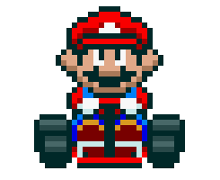
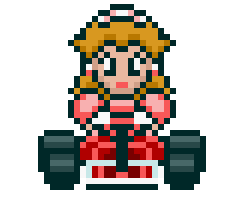

<h1 style="text-align: center; font-size: 2.5rem;"> Desafio de Projeto: Mario Kart JS</h1>

<h2 style="color: #ffa500; border-bottom: 2px solid #333; padding-bottom: 0.3rem; margin-top: 2rem; text-align: center">Introdução</h2>

<table>
    <tr>
        <td>
            
        </td>
        <td>
            

            Mario Kart é uma franquia de jogos de corrida da Nintendo com os personagens do universo Mario Bros. Nosso desafio será criar uma lógica de um jogo de videogame para simular corridas de Mario Kart, levando em consideração as regras e mecânicas abaixo.
            

        </td>
    </tr>
</table>

<h2 style="color: #ffa500; border-bottom: 2px solid #333; padding-bottom: 0.3rem; margin-top: 2rem; text-align: center">Personagens Selecionáveis</h2>

<table style="width: 100%; border-collapse: collapse; margin-top: 1rem; background-color: #1a1b26; color: #fff;">
    <tr>
        <td style="width: 33.33%; padding: 1rem; border: 3px solid #333; vertical-align: middle;">
            

                
                

                    <strong>Mario</strong> 
                    Velocidade: 3 
                    Manobrabilidade: 3 
                    Poder: 3
                

            

        </td>
        <td style="width: 33.33%; padding: 1rem; border: 3px solid #333; vertical-align: middle;">
            

                
                

                    <strong>Luigi</strong> 
                    Velocidade: 4 
                    Manobrabilidade: 3 
                    Poder: 2
                

            

        </td>
        <td style="width: 33.33%; padding: 1rem; border: 3px solid #333; vertical-align: middle;">
            

                
                

                    <strong>Peach</strong> 
                    Velocidade: 3 
                    Manobrabilidade: 4 
                    Poder: 2
                

            

        </td>
    </tr>
    <tr>
        <td style="width: 33.33%; padding: 1rem; border: 3px solid #333; vertical-align: middle;">
            

                
                

                    <strong>Koopa</strong> 
                    Velocidade: 3 
                    Manobrabilidade: 4 
                    Poder: 3
                

            

        </td>
        <td style="width: 33.33%; padding: 1rem; border: 3px solid #333; vertical-align: middle;">
            

                
                

                    <strong>???</strong> 
                    Velocidade: ? 
                    Manobrabilidade: ? 
                    Poder: ?
                

            

        </td>
        <td style="width: 33.33%; padding: 1rem; border: 3px solid #333; vertical-align: middle;">
            

                
                

                    <strong>Yoshi</strong> 
                    Velocidade: 4 
                    Manobrabilidade: 4 
                    Poder: 3
                

            

        </td>
    </tr>
    <tr>
        <td style="width: 33.33%; padding: 1rem; border: 3px solid #333; vertical-align: middle;">
            

                
                

                    <strong>Toad</strong> 
                    Velocidade: 5 
                    Manobrabilidade: 2 
                    Poder: 1
                

            

        </td>
        <td style="width: 33.33%; padding: 1rem; border: 3px solid #333; vertical-align: middle;">
            

                
                

                    <strong>Bowser</strong> 
                    Velocidade: 2 
                    Manobrabilidade: 1 
                    Poder: 5
                

            

        </td>
        <td style="width: 33.33%; padding: 1rem; border: 3px solid #333; vertical-align: middle;">
            

                
                

                    <strong>Donkey Kong</strong> 
                    Velocidade: 2 
                    Manobrabilidade: 1 
                    Poder: 5
                

            </img>
        </td>
    </tr>
</table>

    
    

        <h2 style="color: #ffa500; padding-bottom: 0.3rem; margin: 0; text-align: center;">Itens</h2>
    

    

<table style="width: 100%; border-collapse: collapse; margin-top: 1rem; background-color: #1a1b26; color: #fff;">
    <tr>
        <td style="width: 33.33%; padding: 1rem; border: 3px solid #333; vertical-align: middle;">
            

                
                

                    <strong>Bob-Omb</strong> 
                    Pontos: -3
                

            

        </td>
        <td style="width: 33.33%; padding: 1rem; border: 3px solid #333; vertical-align: middle;">
            

                
                

                    <strong>Boo</strong> 
                    Pontos: 0 
                

            

        </td>
        <td style="width: 33.33%; padding: 1rem; border: 3px solid #333; vertical-align: middle;">
            

                
                

                    <strong>Shell</strong> 
                    Pontos: -2
                

            

        </td>
    </tr>
</table>

<h2 style="color: #ffa500; border-bottom: 2px solid #333; padding-bottom: 0.3rem; margin-top: 2rem; text-align: center">Regras e Mecânicas</h2>

<h3>Jogadores</h3>

<label for="jogadores-item">O computador deve receber dois personagens para disputar a corrida em um objeto cada</label>

<strong>Número de Jogadores:</strong> 2 <input type="checkbox" id="jogadores-item"/>

<h3>Pistas</h3>

<label for="pistas-1-item">Os personagens correrão em uma pista aleatória de 8 rodadas</label>

<strong>Número de Rodadas:</strong> 8 
<input type="checkbox" id="pistas-1-item"/>

<label for="pistas-2-item">A cada rodada, será sorteado um bloco da pista que pode ser uma <strong>reta</strong>, <strong>curva</strong> ou <strong>confronto</strong>:<input type="checkbox" id="pistas-2-item"/></label>

<table style="width: 100%; border-collapse: collapse; margin-top: 1rem; background-color: #1a1b26; color: #fff;">
    <tr>
        <td style="padding: 1rem; border: 3px solid #333; vertical-align: middle;">
            

                
                

                    <strong>Reta</strong>
                    
Caso o bloco da pista seja uma RETA, o jogador deve:

                    <ul>
                        <li>Jogar um dado de 6 lados e somar o atributo VELOCIDADE, quem vencer ganha um ponto <input type="checkbox" id="pistas-2-1-item"/></li> 
                    </ul>
                

            

        </td>
    </tr>
    <tr>
        <td style="padding: 1rem; border: 3px solid #333; vertical-align: middle;">
            

                
                

                    <strong>Curva</strong>
                    
Caso o bloco da pista seja uma CURVA, o jogador deve:

                    <ul>
                        <li>Jogar um dado de 6 lados e somar o atributo MANOBRABILIDADE, quem vencer ganha um ponto <input type="checkbox" id="pistas-2-2-item"/></li> 
                    </ul>
                

            

        </td>
    </tr>
    <tr>
        <td style="padding: 1rem; border: 3px solid #333; vertical-align: middle;">
            

                
                

                    <strong>Confronto</strong><input type="checkbox" id="pistas-2-3-item"/>
                    
Caso o bloco da pista seja um CONFRONTO, o jogador deve:

                    <ol>
                        <li>Receber um item aleatório da lista<input type="checkbox" id="pistas-2-3-1-item"/></li>
                        <li>Jogar um dado de 6 lados<input type="checkbox" id="pistas-2-3-2-item"/></li>
                        <li>Realizar cálculos de confronto<input type="checkbox" id="pistas-2-3-3-item"/></li>
                        <ul>
                            <li>Cálculo Normal: <input type="checkbox" id="pistas-2-3-3-1-item"/></li>
                            <ul>
                                <li>ItemInimigo + Dado + PODER</li>
                            </ul>
                            <li>Se jogador recebeu o item Boo: <input type="checkbox" id="pistas-2-3-3-2-item"/></li>
                            <ul>
                                <li>(ItemInimigo x Item) + Dado + PODER</li>
                            </ul>
                        </ul>
                    </ol>
                    
Ao final do confronto, aquele que perder, perderá 1 ponto: <input type="checkbox" id="pistas-2-3-4-item"/>

                

            

        </td>
    </tr>
</table>

<label for="pistas-2-4-item">Nenhum jogador pode terminar a corrida com pontuação negativa <input type="checkbox" id="pistas-2-4-item"/></label>

<strong>Condições de Vitória:</strong> <label for="vitoria-item">Ao final, vence quem acumulou mais pontos</label> <input type="checkbox" id="-item"/>